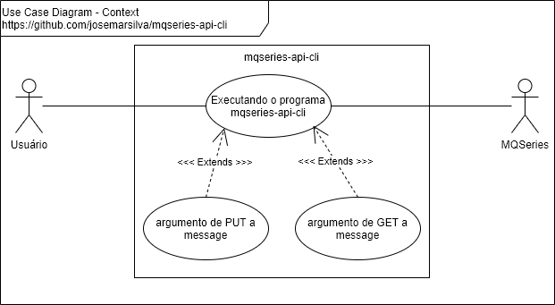
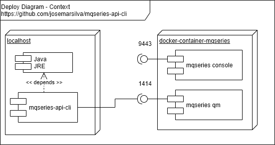

# README - mqseries-api-cli

## 1. Introdução

Este é o repositório do projeto **mqseries-api-cli**.

## 2. Documentação

### 2.1. Use Case Diagram

 


### 2.2. Deploy Diagram

 


## 3. Project

### 3.1. Preconditions

* Java JDK 1.8 (jar file includes runnable)
* Eclipse (version Neon recommended)
* Apache Maven 3.6 (recommended > 3.3)
* `pom.xml`:
  * properties:
    * `<project.build.sourceEncoding>UTF-8</project.build.sourceEncoding>`
  * dependencies:
    * https://mvnrepository.com/artifact/commons-cli/commons-cli
	* https://mvnrepository.com/artifact/com.ibm.mq/com.ibm.mq.allclient
	* https://mvnrepository.com/artifact/javax/javaee-api/8.0
  * build:
    * `<finalName>mqseries-api-cli</finalName>`
	* `<plugin> <artifactId>maven-assembly-plugin</artifactId> </plugin>`
* [MQSeries instalado - Docker Container](https://github.com/josemarsilva/eval-virtualbox-vm-ubuntu-server#412-docker---mq-series)


### 3.2. Guide for Developers

* Clone source code using "git clone". Use branch "master" if branch "develop" is not available.
* Read, if avaliable, "2. Documentation"  and "3.X. Guides, Patterns, Standard, Conventions and Best Practices" to understand patterns, standards, conventions and best practices used in this project.
* Make your changes, commit and push on "develop" branch. Use branch "master" if branch "develop" is not available. Ask me permission, if not available permission to push.


### 3.3. Guide for Configuration

#### 3.3.1. Configuring a MQSeries Trigger on Linux

* Open a bash shell on MQSeries docker container

```bash
$ CONTAINER_ID=`sudo docker ps | grep ibmcom/mq | cut -d ' ' -f 1`
$ echo CONTAINER_ID = $CONTAINER_ID
$ sudo docker exec \
  --tty \
  --interactive \
  ${CONTAINER_ID} \
  bash
```

* Now we are inside MQSeries docker container machine

```bash
bash-4.4$ id
uid=888(mqm) gid=888(mqm) groups=888(mqm),0(root)
```

* Run MQSeries-ScriptCommand to create triggered queue, configure process, etc

```bash
bash-4.4$ runmqsc QM1
```

```console
5724-H72 (C) Copyright IBM Corp. 1994, 2019.
Starting MQSC for queue manager QM1.
AMQ8521I: Command completion and history unavailable.
```

* Display Queue Status before starting

```runmqsc
 display qmstatus
```

```console
AMQ8705I: Display Queue Manager Status Details.
   QMNAME(QM1)                             STATUS(RUNNING)
```

* Create a triggered queue on ´runmqsc´

```runmqsc
DEFINE QLOCAL(DEV.QUEUE.3) REPLACE +
  TRIGGER +
  TRIGTYPE(first) +
  INITQ(SYSTEM.DEFAULT.INITIATION.QUEUE) +
  PROCESS(proc1) +
  DESCR('This is a triggered queue 1')
```

```console
AMQ8006I: IBM MQ queue created.
```

```runmsc
DISPLAY QUEUE(TRG*)
```

```console
AMQ8409I: Display Queue details.
   QUEUE(TRG.QUEUE.1)                      TYPE(QLOCAL)
```

* Create a process program to be executed by trigger monitor

```runmsc
DEFINE PROCESS(proc1) REPLACE +
  DESCR('Process to start server program') +
  APPLTYPE(UNIX) +
  APPLICID('id >> /tmp/mqseries-trigger-program.log')
```

```console
AMQ8010I: IBM MQ process created.
```

* Edit your `/tmp/mqseries-trigger-program.sh`

```bash
bash-4.4$ vi /tmp/mqseries-trigger-program.sh
```

```vi
# /usr/bin/bash
date >> /tmp/mqseries-trigger-program.log
```

```bash
bash-4.4$ chmod 777 /tmp/mqseries-trigger-program.sh
```


### 3.4. Guide for Test

* n/a

### 3.5. Guide for Deploy

* n/a

### 3.6. Guide for Demonstration

* Running `mqseries-api-cli.jar` without arguments shows command line arguments options

```cmd
C:\...\dist> java -jar mqseries-api-cli.jar
Missing required options: A, H, P, C, Q, p, q
usage: mqseries-api-cli [<args-options-list>] - v.2020.02.29.2359
 -A,--action <arg>                      Action launched. List of values: (
                                        'put', 'get', 'get-all' ). Ex: -A
                                        put
 -C,--channel <arg>                     Channel name. Ex: -C
                                        DEV.APP.SVRCONN
 -f,--message-file <arg>                Message file to put to or get from
                                        body. Ex: -f msg.txt
 -h,--help                              shows usage help message. See more
                                        https://github.com/josemarsilva/mq
                                        series-api-cli
 -H,--host <arg>                        Host name or IP address. Ex: -H
                                        127.0.0.1
 -m,--message-body <arg>                Message body to put. Ex: -m
                                        01020304050607080910
 -n,--user-authentication-mqcsp <arg>   User Authentication MQCSP. Values
                                        ('true', 'false'). Default: 'true'
 -P,--port <arg>                        Listener port number for your
                                        queue manager. Ex: -P 1414
 -p,--app-password <arg>                Application Password to connect to
                                        MQ. Ex: -p passw0rd
 -Q,--qmgr <arg>                        Queue manager name. Ex: -Q QM1
 -q,--queue-name <arg>                  Queue name mqseries-api-cli uses
                                        to put or get messages to and
                                        from. Ex: -q DEV.QUEUE.1
 -u,--app-user <arg>                    Application User to connect to MQ.
                                        Default: ''
```


### 3.6.1. Demonstration of PUT

* Running `run-demo-01.bat` you will PUT a message on the queue

```cmd
C:\...\dist>run-demo-01.bat
```

```console

java -jar mqseries-api-cli.jar -A put -H 127.0.0.1 -P 1414 -C DEV.APP.SVRCONN -Q QM1 -p passw0rd -q DEV.QUEUE.1 -m MSG-RUN-DEMO-01

mqseries-api-cli - v.2020.02.29.1900
Sent message:

  JMSMessage class: jms_text
  JMSType:          null
  JMSDeliveryMode:  2
  JMSDeliveryDelay: 0
  JMSDeliveryTime:  1583013940217
  JMSExpiration:    0
  JMSPriority:      4
  JMSMessageID:     ID:414d5120514d31202020202020202020edc55a5e02125e25
  JMSTimestamp:     1583013940217
  JMSCorrelationID: null
  JMSDestination:   queue:///DEV.QUEUE.1
  JMSReplyTo:       null
  JMSRedelivered:   false
    JMSXAppID: MqSeries API CLI
    JMSXDeliveryCount: 0
    JMSXUserID: app
    JMS_IBM_PutApplType: 28
    JMS_IBM_PutDate: 20200229
    JMS_IBM_PutTime: 22054024
MSG-RUN-DEMO-01
```

### 3.6.2. Demonstration of PUT

* Running `run-demo-02.bat` you will GET a message from the queue

```cmd
C:\...\dist>run-demo-02.bat
```

```console

java -jar mqseries-api-cli.jar -A get -H 127.0.0.1 -P 1414 -C DEV.APP.SVRCONN -Q QM1 -p passw0rd -q DEV.QUEUE.1

mqseries-api-cli - v.2020.02.29.1900

Received message:
MSG-RUN-DEMO-01
```


### 3.6.3. Demonstration of PUT a file content

* Running `run-demo-03.bat` you will PUT file contentes into a message queue

```cmd
C:\...\dist>run-demo-03.bat
```

```console

java -jar mqseries-api-cli.jar -A put -H 127.0.0.1 -P 1414 -C DEV.APP.SVRCONN -Q QM1 -p passw0rd -q DEV.QUEUE.1 -f message-file-send-example.txt

mqseries-api-cli - v.2020.02.29.1900
Sent message:

  JMSMessage class: jms_text
  JMSType:          null
  JMSDeliveryMode:  2
  JMSDeliveryDelay: 0
  JMSDeliveryTime:  1583014433248
  JMSExpiration:    0
  JMSPriority:      4
  JMSMessageID:     ID:414d5120514d31202020202020202020edc55a5e02185e25
  JMSTimestamp:     1583014433248
  JMSCorrelationID: null
  JMSDestination:   queue:///DEV.QUEUE.1
  JMSReplyTo:       null
  JMSRedelivered:   false
    JMSXAppID: MqSeries API CLI
    JMSXDeliveryCount: 0
    JMSXUserID: app
    JMS_IBM_PutApplType: 28
    JMS_IBM_PutDate: 20200229
    JMS_IBM_PutTime: 22135327
This is the content of file 'message-file-send-example.txt' sent in message
```


### 3.6.4. Demonstration of GET into a file content

* Running `run-demo-04.bat` you will GET a message from a queue and save it into a file

```cmd
C:\...\dist>run-demo-04.bat
```

```console

java -jar mqseries-api-cli.jar -A put -H 127.0.0.1 -P 1414 -C DEV.APP.SVRCONN -Q QM1 -p passw0rd -q DEV.QUEUE.1 -f message-file-send-example.txt

mqseries-api-cli - v.2020.02.29.1900
Sent message:

  JMSMessage class: jms_text
  JMSType:          null
  JMSDeliveryMode:  2
  JMSDeliveryDelay: 0
  JMSDeliveryTime:  1583014433248
  JMSExpiration:    0
  JMSPriority:      4
  JMSMessageID:     ID:414d5120514d31202020202020202020edc55a5e02185e25
  JMSTimestamp:     1583014433248
  JMSCorrelationID: null
  JMSDestination:   queue:///DEV.QUEUE.1
  JMSReplyTo:       null
  JMSRedelivered:   false
    JMSXAppID: MqSeries API CLI
    JMSXDeliveryCount: 0
    JMSXUserID: app
    JMS_IBM_PutApplType: 28
    JMS_IBM_PutDate: 20200229
    JMS_IBM_PutTime: 22135327
This is the content of file 'message-file-send-example.txt' sent in message
```

### 3.6.4. Demonstration of PUT into queue with trigger

* Running `run-demo-05.bat` you will PUT a message into a queue with trigger

```cmd
C:\...\dist>run-demo-05.bat
```

```console
java -jar mqseries-api-cli.jar -A put -H 127.0.0.1 -P 1414 -C DEV.APP.SVRCONN -Q QM1 -p passw0rd -q DEV.QUEUE.3 -m MSG-RUN-DEMO-05-TRIGGER-QUEUE

mqseries-api-cli - v.2020.02.29.2359
Sent message:

  JMSMessage class: jms_text
  JMSType:          null
  JMSDeliveryMode:  2
  JMSDeliveryDelay: 0
  JMSDeliveryTime:  1583151166622
  JMSExpiration:    0
  JMSPriority:      4
  JMSMessageID:     ID:414d5120514d3120202020202020202008f55c5e02ae3a21
  JMSTimestamp:     1583151166622
  JMSCorrelationID: null
  JMSDestination:   queue:///DEV.QUEUE.3
  JMSReplyTo:       null
  JMSRedelivered:   false
    JMSXAppID: MQSeries API CLI
    JMSXDeliveryCount: 0
    JMSXUserID: app
    JMS_IBM_PutApplType: 28
    JMS_IBM_PutDate: 20200302
    JMS_IBM_PutTime: 12124513
MSG-RUN-DEMO-05-TRIGGER-QUEUE
```


### 3.6.6. Demonstration of GET from a queue with trigger

* Running `run-demo-06.bat` you will GET a message from a queue with trigger

```cmd
C:\...\dist>run-demo-06.bat
```

```console
java -jar mqseries-api-cli.jar -A get -H 127.0.0.1 -P 1414 -C DEV.APP.SVRCONN -Q QM1 -p passw0rd -q DEV.QUEUE.3

mqseries-api-cli - v.2020.02.29.2359

Received message:
MSG-RUN-DEMO-05-TRIGGER-QUEUE
```

### 3.6.6. Demonstration of GET-ALL from a queue and save to file

* Running `run-demo-07.bat` you will GET-ALL message from a queue and write to file

```cmd
C:\...\dist>run-demo-07.bat
```

```console

java -jar mqseries-api-cli.jar -A get-all -H 127.0.0.1 -P 1414 -C DEV.APP.SVRCONN -Q QM1 -p passw0rd -q DEV.QUEUE.3 -f message-file-received-example.txt

mqseries-api-cli - v.2020.02.29.2359

Received message:
BLABLEBLIBLOBLU
Writing ReceivedMessage to file 'message-file-received-example(1).txt'

Received message:
blableblibloblu
Writing ReceivedMessage to file 'message-file-received-example(2).txt'

Received message:
S0000002.LOG
Writing ReceivedMessage to file 'message-file-received-example(3).txt'

Received message:

```


### 3.7. Patterns, Standard, Conventions and Best Practices

* n/a


## I - References

* https://github.com/josemarsilva/eval-java-mqseries
* [Point to point with JMS MQSeries Tutorial](https://developer.ibm.com/messaging/learn-mq/mq-tutorials/develop-mq-jms/)
* [Developing Java applications for MQ just got easier with Maven](https://developer.ibm.com/messaging/2018/01/09/developing-mq-java-applications-maven/)
* [https://mvnrepository.com/artifact/com.ibm.mq/com.ibm.mq.allclient/9.1.4.0](https://mvnrepository.com/artifact/com.ibm.mq/com.ibm.mq.allclient/9.1.4.0)
